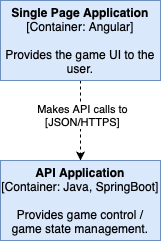

# Tschau-Sepp

## Intro

Tschau Sepp is a swiss card game. For more infos see [Tschau Sepp on jassverzeichnis.ch](https://www.jassverzeichnis.ch/index.php/blog/115-tschau-sepp-jassen-lernen).
To play the game, two devices/browsers are required. 
It was created on two lazy christmas days and may have some bugs & imperfections.

It is hosted on Baloise Incubator for testing purposes that can be accessed [here](https://yannick-tschau-sepp.apps.okd.baloise.dev). 

## Travis-CI Build Status

## Image Registry
https://hub.docker.com/r/yannickholzenkamp/tschau-sepp-frontend
https://hub.docker.com/r/yannickholzenkamp/tschau-sepp-backend

## Architecture

### Container diagram

### Component diagram
TODO
